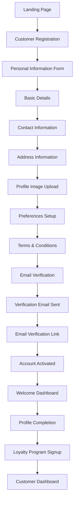
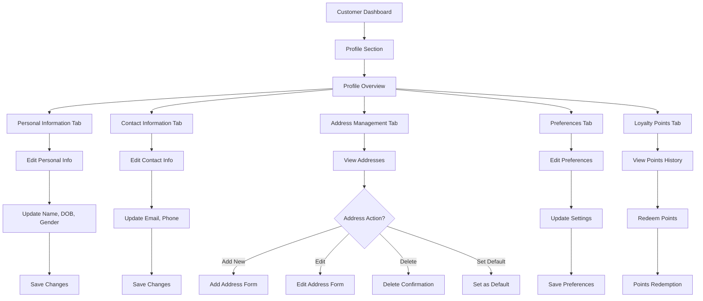
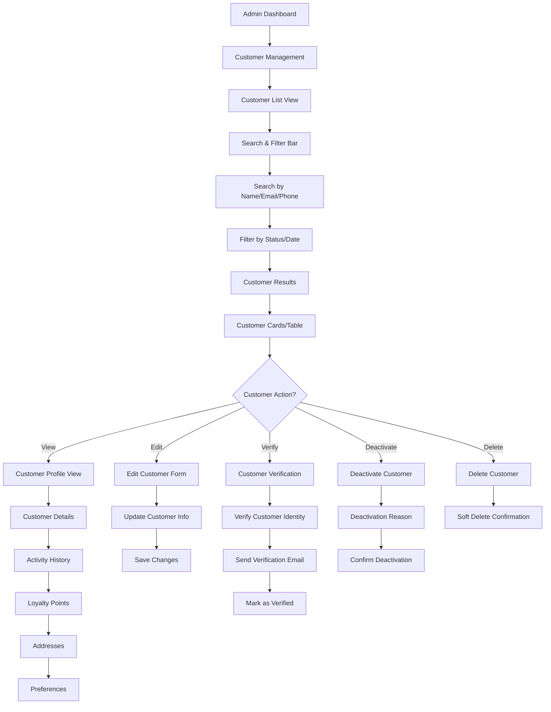
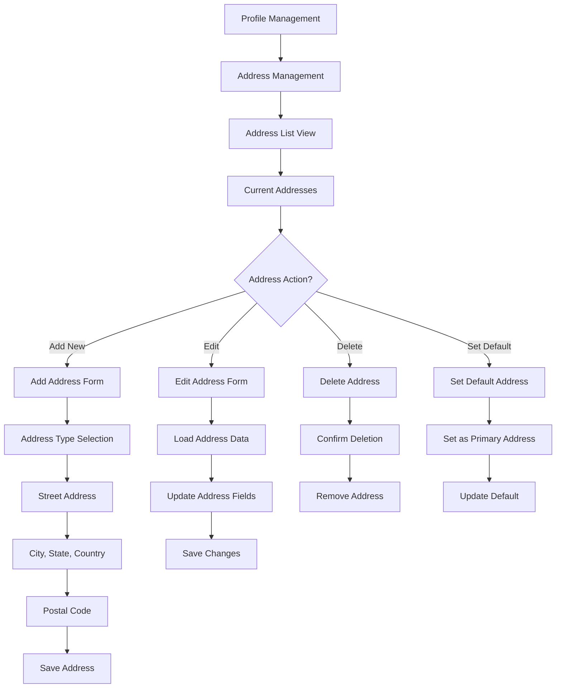
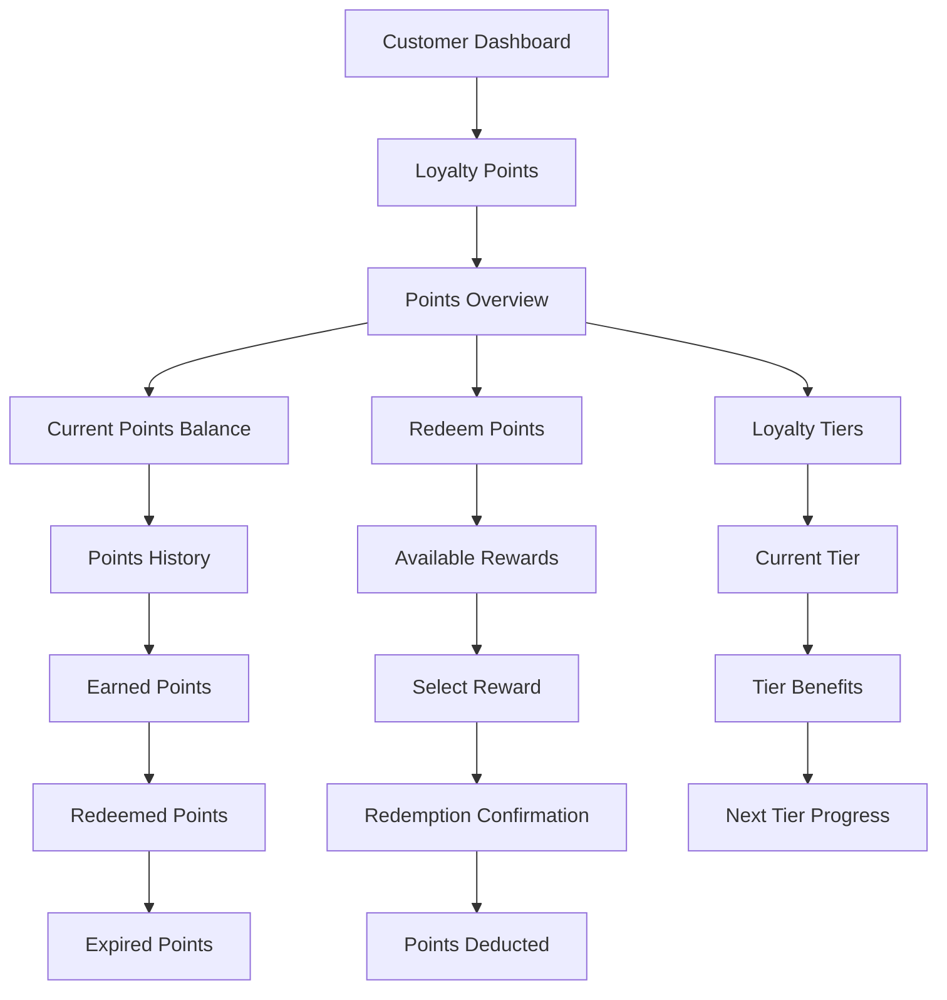

# Customer Service UI Flow Documentation

## Overview
The Customer Service handles customer management, profiles, preferences, addresses, loyalty points, and customer analytics for the Rubizz Hotel Inn platform.

## Core Features

### 1. Customer Management
- Customer registration and profile management
- Customer search and filtering
- Customer statistics and analytics
- Customer verification and activation

### 2. Profile Management
- Personal information management
- Contact information updates
- Profile image upload
- Preferences and settings

### 3. Address Management
- Multiple addresses per customer
- Address type classification
- Default address selection
- Address validation

### 4. Loyalty System
- Loyalty points earning and redemption
- Points history tracking
- Loyalty tier management
- Rewards and benefits

### 5. Activity Tracking
- Customer activity audit trail
- Login history
- Profile update tracking
- System interaction logging

## UI Flow Diagrams

### 1. Customer Registration & Onboarding Flow



### 2. Customer Profile Management Flow



### 3. Customer Search & Management Flow (Admin)



### 4. Address Management Flow



### 5. Loyalty Points Management Flow



## Key UI Components

### 1. Customer Registration Form

#### Personal Information Section
- **Basic Details**
  - First Name (required)
  - Last Name (required)
  - Date of Birth (optional)
  - Gender (optional dropdown)

- **Contact Information**
  - Email (required, unique)
  - Phone (required, unique)
  - Alternative Phone (optional)

- **Address Information**
  - Street Address (optional)
  - City (optional)
  - State/Province (optional)
  - Country (optional)
  - Postal Code (optional)

#### Profile Setup Section
- **Profile Image Upload**
  - Image upload area
  - Image preview
  - Image validation
  - Default avatar option

- **Preferences**
  - Language selection
  - Timezone selection
  - Communication preferences
  - Marketing preferences

### 2. Customer Profile Dashboard

#### Profile Header
- **Profile Image**
  - Large profile photo
  - Image upload button
  - Default avatar fallback

- **Customer Information**
  - Full name
  - Email and phone
  - Member since date
  - Loyalty tier badge

- **Quick Actions**
  - Edit profile button
  - Settings button
  - Help & support link

#### Profile Tabs
- **Personal Information Tab**
  - Editable personal details
  - Contact information
  - Save/cancel buttons

- **Address Management Tab**
  - Address list with cards
  - Add new address button
  - Edit/delete actions
  - Default address indicator

- **Preferences Tab**
  - Language settings
  - Notification preferences
  - Privacy settings
  - Communication preferences

- **Loyalty Points Tab**
  - Current points balance
  - Points history table
  - Redeem points section
  - Loyalty tier information

- **Activity History Tab**
  - Activity timeline
  - Filter by activity type
  - Export activity data
  - Activity details modal

### 3. Customer Management Dashboard (Admin)

#### Search & Filter Section
- **Search Bar**
  - Search by name, email, phone
  - Real-time search suggestions
  - Clear search button

- **Filter Options**
  - Status filter (Active/Inactive)
  - Date range filter
  - Loyalty tier filter
  - Registration date filter

- **Sort Options**
  - Name (A-Z, Z-A)
  - Registration date
  - Last activity
  - Loyalty points

#### Customer List View
- **Customer Cards/Table**
  - Profile image thumbnail
  - Name and contact info
  - Registration date
  - Last activity
  - Loyalty tier
  - Status indicator

- **Bulk Actions**
  - Select multiple customers
  - Bulk email sending
  - Bulk status updates
  - Export selected data

#### Customer Details Modal
- **Customer Information**
  - Full profile details
  - Contact information
  - Address information
  - Preferences

- **Activity Timeline**
  - Recent activities
  - Login history
  - Profile updates
  - System interactions

- **Loyalty Information**
  - Current points
  - Points history
  - Tier benefits
  - Redemption history

### 4. Address Management Interface

#### Address List
- **Address Cards**
  - Address type badge
  - Full address display
  - Default address indicator
  - Edit/delete buttons

- **Add New Address Button**
  - Prominent add button
  - Quick address form
  - Address validation

#### Address Form
- **Address Type Selection**
  - Home, Work, Billing, Shipping
  - Other (with custom input)
  - Type-specific icons

- **Address Fields**
  - Street address (required)
  - Apartment/Unit (optional)
  - City (required)
  - State/Province (required)
  - Country (required)
  - Postal code (required)

- **Address Actions**
  - Save address
  - Cancel editing
  - Set as default
  - Delete address

### 5. Loyalty Points Interface

#### Points Overview
- **Current Balance**
  - Large points display
  - Points value in currency
  - Tier progress bar

- **Quick Actions**
  - Redeem points button
  - View history button
  - Earn more points link

#### Points History
- **Transaction Table**
  - Date and time
  - Transaction type
  - Points amount (+/-)
  - Description
  - Balance after transaction

- **Filter Options**
  - Transaction type filter
  - Date range filter
  - Points amount filter

#### Rewards Catalog
- **Available Rewards**
  - Reward categories
  - Points cost
  - Reward description
  - Availability status

- **Redemption Process**
  - Select reward
  - Confirm redemption
  - Points deduction
  - Reward delivery

## API Integration Points

### 1. Customer Management
```typescript
// Create customer
POST /api/v1/customers
{
  "firstName": "John",
  "lastName": "Doe",
  "email": "john@example.com",
  "phone": "+1234567890",
  "dateOfBirth": "1990-01-01",
  "gender": "MALE",
  "address": {
    "street": "123 Main St",
    "city": "New York",
    "state": "NY",
    "country": "USA",
    "postalCode": "10001",
    "type": "HOME"
  }
}

// Get customer by ID
GET /api/v1/customers/:customerId

// Update customer
PUT /api/v1/customers/:customerId
{
  "firstName": "John",
  "lastName": "Doe",
  "email": "john@example.com",
  "phone": "+1234567890"
}
```

### 2. Address Management
```typescript
// Add address
POST /api/v1/customers/:customerId/addresses
{
  "street": "456 Oak Ave",
  "city": "Los Angeles",
  "state": "CA",
  "country": "USA",
  "postalCode": "90210",
  "type": "WORK",
  "isDefault": false
}

// Update address
PUT /api/v1/addresses/:addressId
{
  "street": "456 Oak Ave",
  "city": "Los Angeles",
  "state": "CA",
  "country": "USA",
  "postalCode": "90210",
  "type": "WORK",
  "isDefault": true
}
```

### 3. Loyalty Points
```typescript
// Get loyalty points
GET /api/v1/customers/:customerId/loyalty-points

// Redeem points
POST /api/v1/customers/:customerId/loyalty-points/redeem
{
  "rewardId": "reward-id",
  "points": 1000
}
```

## Error Handling

### 1. Validation Errors
- Field-level error messages
- Form validation feedback
- Required field indicators
- Format validation (email, phone)

### 2. Business Logic Errors
- Email already exists
- Phone number already registered
- Invalid address format
- Insufficient loyalty points

### 3. System Errors
- Network connection errors
- Server timeout errors
- Database connection errors
- External service failures

## Real-time Features

### 1. Live Updates
- Profile changes sync
- Address updates
- Loyalty points updates
- Activity notifications

### 2. Notifications
- Profile update confirmations
- Address change notifications
- Loyalty points earned
- System announcements

### 3. WebSocket Integration
- Real-time activity updates
- Live profile synchronization
- Instant notifications
- Status updates

## Mobile Responsiveness

### 1. Mobile Profile Management
- Touch-friendly forms
- Mobile image upload
- Swipe gestures for actions
- Mobile-optimized layouts

### 2. Mobile Address Management
- GPS location integration
- Mobile address validation
- Touch-friendly address forms
- Mobile map integration

### 3. Mobile Loyalty Points
- Mobile-friendly points display
- Touch redemption interface
- Mobile notifications
- Offline points tracking

## Security Considerations

### 1. Data Protection
- Customer data encryption
- Secure data transmission
- Privacy settings
- GDPR compliance

### 2. Authentication
- Secure login process
- Session management
- Password security
- Two-factor authentication

### 3. Authorization
- Role-based access control
- Permission checking
- Data access restrictions
- Audit trail logging

## Performance Optimizations

### 1. Lazy Loading
- Customer list pagination
- Image lazy loading
- Component lazy loading
- Data virtualization

### 2. Caching
- Customer data caching
- Profile image caching
- API response caching
- Local storage caching

### 3. Optimization
- Database query optimization
- Image compression
- Bundle size optimization
- Network request optimization
